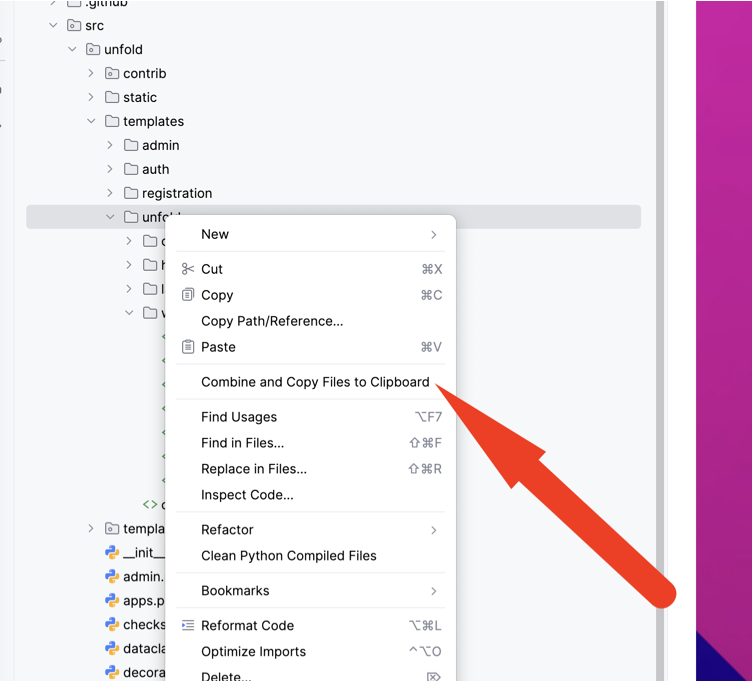

### JetBrains Plugin - Combine Files and Copy to Clipboard for LLM Input

**[Plugin Download Link](https://plugins.jetbrains.com/plugin/25635-copy-files-to-clipboard-for-llm)**

**The Combine and Copy Files to Clipboard Plugin** merges multiple files into a single document, separated by their relative file paths/names, and copies the final content to your clipboard. It's perfect for combining frontend components, code snippets, logs, or notes for pasting into AI tools to provide richer context.

**Installation Instructions:**
- Navigate to `Settings -> Plugins -> Marketplace` and search for `Combine and Copy Files to Clipboard`, or use the [Plugin Download Link](https://plugins.jetbrains.com/plugin/25635-copy-files-to-clipboard-for-llm)

**Main Features:**
- **Select Multiple Files:** Directly select files from the project view and copy them using the context menu.
- **Content Merging:** Combine files with headers that include relative file paths (excluding usernames like `/Users/Alex/...` for privacy).

**Usage Instructions:**
1. **Select Files:** In the Project view, use Ctrl + Click or Cmd + Click to select multiple files.
2. **Merge Files:** Right-click the selected files and choose **Combine and Copy Files to Clipboard** from the context menu, or navigate to `Tools -> Combine and Copy Files to Clipboard`.
3. **Copy to Clipboard:** The merged content, separated by the files' relative paths/names, is copied to your clipboard.
4. **Paste Content:** Paste the merged content wherever you need it.

**Possible Applications:**
- **ChatGPT Integration:** Merge different types of files to provide AI tools with richer context.
- **Code Review:** Combine source code files for thorough reviews.
- **Documentation:** Gather notes and code snippets for easy distribution.
- **Data Analysis:** Consolidate logs and reports for comprehensive analysis.
- **Content Creation:** Assemble research notes or chapters for smooth editing.